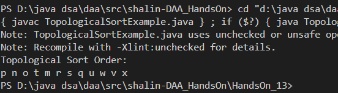
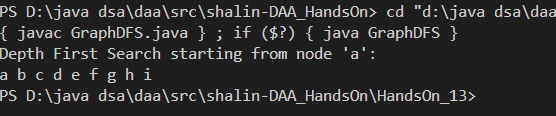
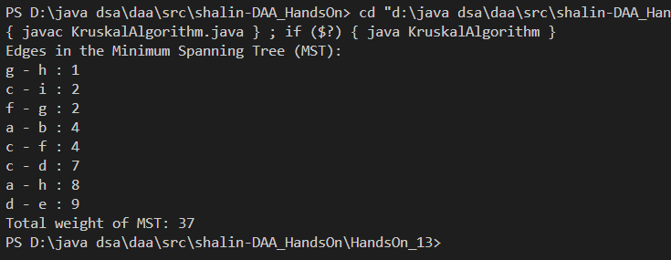

# HandsOn_11

# Problem 1

* Code for Topological sort is given [`TopologicalSortExample.java`](TopologicalSortExample.java)

 

 
 

# Problem 2

* Code for Depth-First Search is given [`GraphDFS.java`](GraphDFS.java)

 

 
 

# Problem 3

* Code for KruskalAlgorithm is given [`KruskalAlgorithm.java`](KruskalAlgorithm.java)

 

