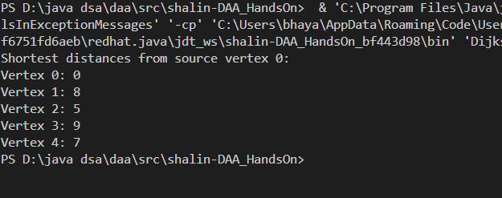
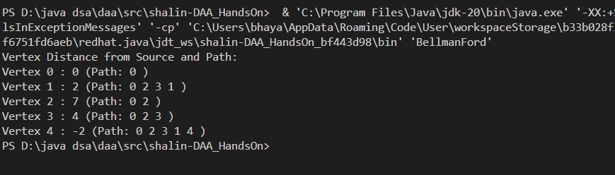
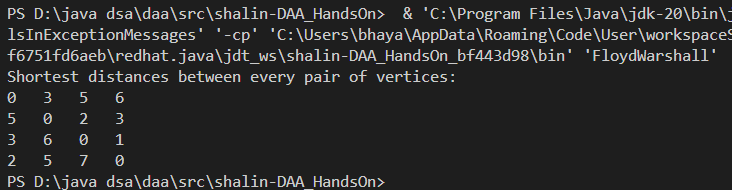

# HandsOn_14

# Problem 1

* Code for Dijkstra's algorithm is given [`DijkstraMain.java`](DijkstraMain.java)

 

 
 

# Problem 2

* Code for BellmanFord is given [`BellmanFord.java`](BellmanFord.java)

 

 
 

# Problem 3

* Code for Flyod-Warshall is given [`FloydWarshall.java`](FloydWarshall.java)

 

