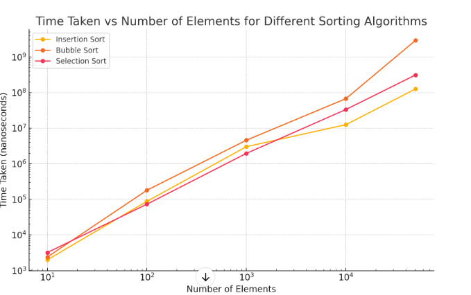

System Information

Processor        11th Gen Intel(R) Core(TM) i7-1165G7 @ 2.80GHz   2.70 GHz
RAM              16.0 GB (15.7 GB usable)
System Type      64-bit operating system, x64-based processor
OS               Windows 11 Home

Given graph now plots the time in nanoseconds taken by the insertion sort, bubble sort, and selection sort against the number of elements on a logarithmic scale to show their increased computational cost with a growing number of elements.

