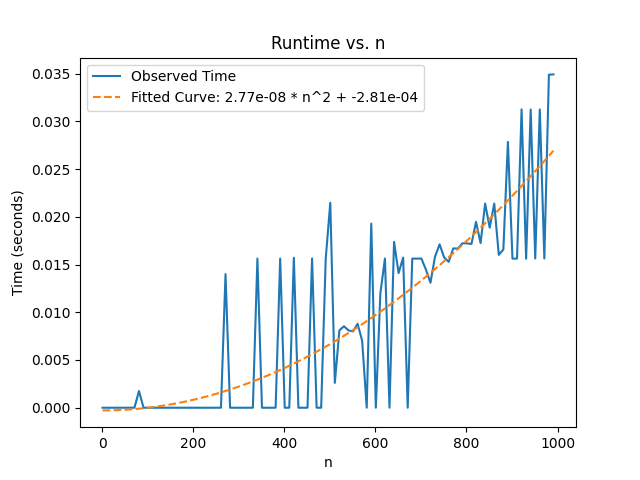
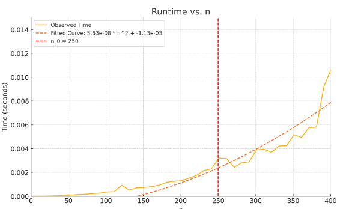

# Hands-on 3
function x = f(n)  
x = 1;  
for i = 1:n  
for j = 1:n 
x = x + 1;

1.Find the runtime of the algorithm mathematically.

2.Time this function for various n e.g. n = 1,2,3.... You should have small values of n all the way up to large values. Plot "time" vs "n" (time on y-axis and n on x-axis). Also, fit a curve to your data, hint it's a polynomial.  
   <b> Ans </b>

3.Find polynomials that are upper and lower bounds on your curve from #2. From this specify a big-O, a big-Omega, and what big-theta is.  
<b>Ans.</b>
The fitted curve is a quadratic function of the form y = ax^2 + c.
Big-O: O(n^2).This means that the runtime is bounded above by a constant multiple of n^2 for sufficiently large n.  
Big-Omega:Ω(n^2).This means that the runtime is bounded below by a constant multiple of n^2 for sufficiently large n.  
Big-Theta:Θ(n^2).This means that the runtime is asymptotically equivalent to n^2.  

4.Find the approximate (eye ball it) location of "n_0" . Do this by zooming in on your plot and indicating on the plot where n_0 is and why you picked this value. Hint: I should see data that does not follow the trend of the polynomial you determined in #2. 
<b>Ans</b>

* n_0=250 is the point where the observed runtime begins to closely follow the quadratic trend of the fitted curve. Before this, the data fluctuates and does not align well with the curve, which is why n_0 was chosen at this value.

## If I modified the function to be:
x = f(n)  
x = 1;  
y = 1; 
for i = 1:n 
for j = 1:n 
x = x + 1; 
`   `y = i + j;
4. Will this increate how long it takes the algorithm to run (e.x. you are timing the function like in #2)?  
**Ans**. Newly add operation (y = i + j) in inner loop has constant time complexity of O(1).So,it will not significant impact on runtime of function.

5. Will it effect your results from #1? 
**Ans** The changes will not affect the overall runtime complexity of the function. It remains O(n^2), Big-Omega(n^2), and Big-Theta(n^2).

6.  Implement merge sort, upload your code to github and show/test it on the array [5,2,4,7,1,3,2,6]. 

**Ans**