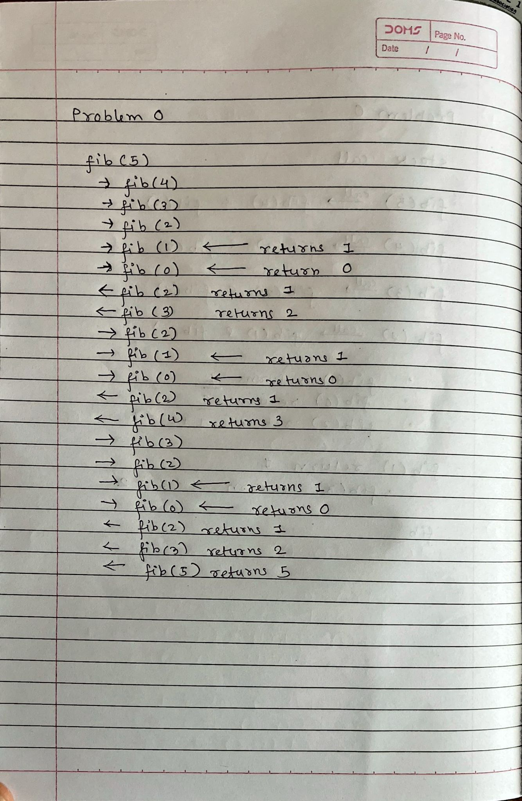

# HandsOn-4

## Problem 0

Ans :-

Code for Fibonacci is  [`Fibonacci.java`](Fibonacci.java)

 

## Problem 1

Code for Problem 1 is  [`problem_1.java`](problem_1.java)

### Prove the time complexity of the Algorithm

* The <b>mergeTwoArrays<b> method, merges two sorted arrays,it take O(n1 + n2) where n1 and n2 are size of array which are being merged.The <b>mergeSortedArrays<b> method, which recursively merges K arrays of size N each involves splitting the arrays into halves and merging them. The recursive depth is O(log K ) and each level of recursion performs O(k*k).So,the overall time complexity of the entire merging process is O(K * Nlog(k)),where K is the number of arrays and N is the size of each array

### Comment on way's you could improve your implementation

* The current recursive solution could be improved by changing it to an iterative one. Recursion might cause stack overflow when there are many arrays or deep levels of recursion. Using an iterative approach, where arrays are merged in pairs in a loop, can help avoid this problem.

 

## Problem 2

Code for Problem 2 is  [`problem_2.java`](problem_2.java)

### Prove the time complexity of the Algorithm

* The for loop in <b>removeDuplicat</b>method will iterate <b> n-1 </b> time,where n is the length of the array and inside for loop there is if statement which has constant time complexity of O(1).So,the Overall time complexity is O(n).

### Comment on way's you could improve your implementation

* For very large arrays,performance can be problem because the time complexity is O(n).If n is big enough it can cause problem in that one solution can be use of parallel processing dividing arrays and processing each part to remove duplicate and at last merge all parts in one.