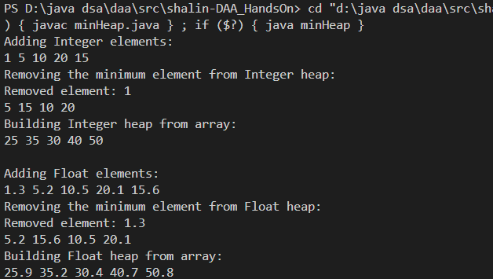

# HandsOn-5

Code for MinHeap is  [`minHeap.java`](minHeap.java)
 
 
* All functionality are displayed in output. 

* The heap is generic (MinHeap<T extends Comparable<T>>), so it can store any type that implements Comparable, like Integer, Float, or custom objects with comparable properties.