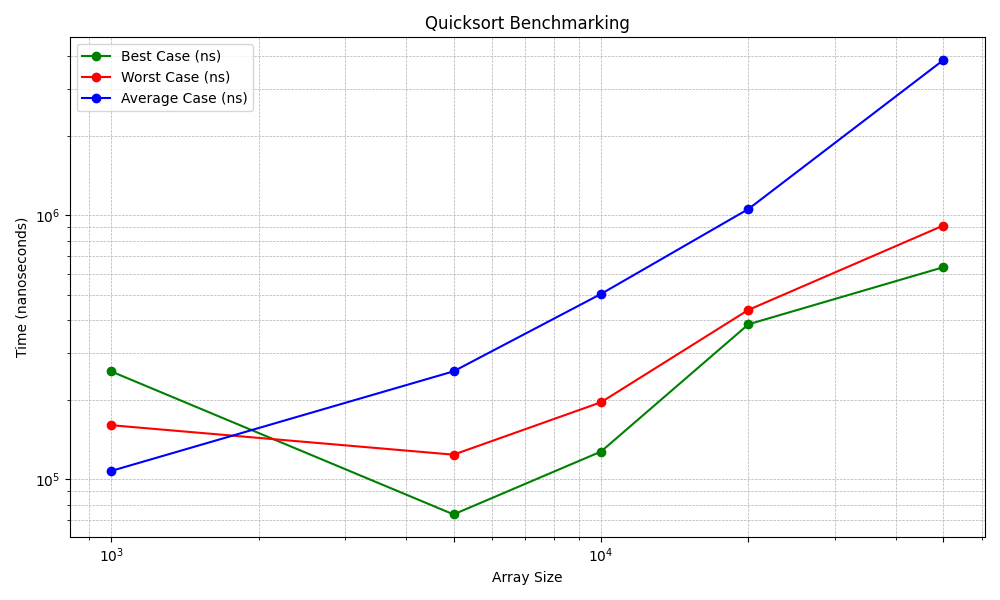
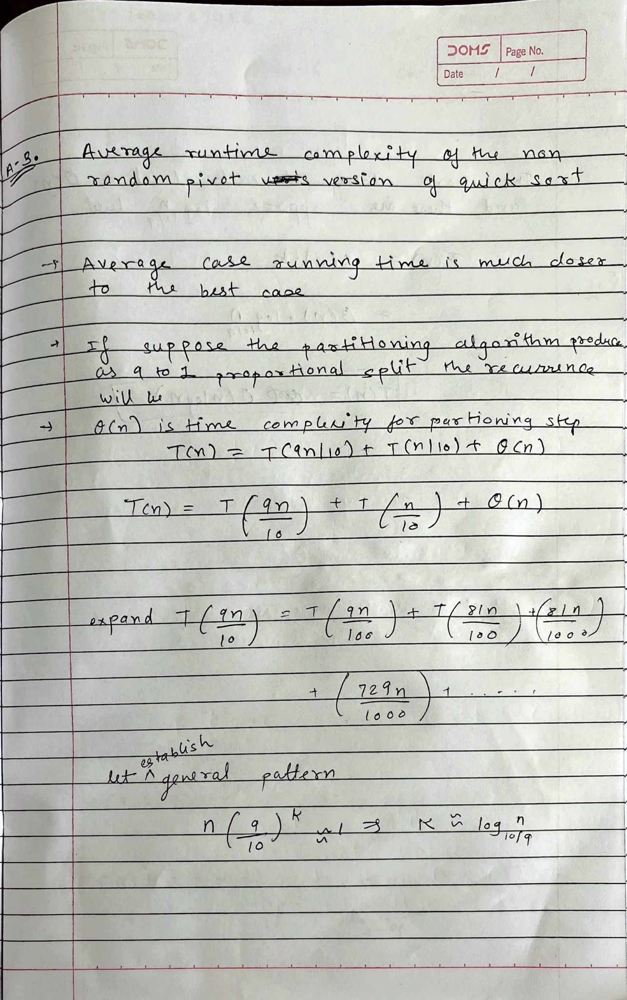
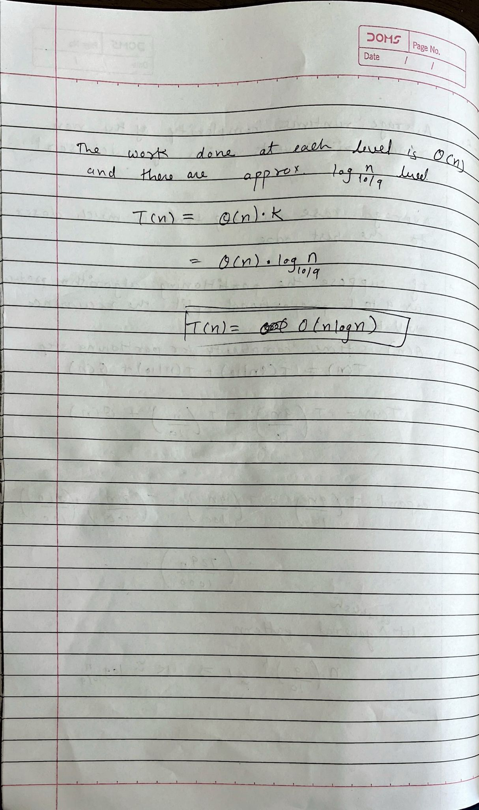

# HandsOn_6

# Problem 1

* Code for QuickSort with Random Pivot  is  [`QuicksortRandom.java`](QuicksortRandom.java)

* Code for QuickSort with NonRandom Pivot  is  [`QuicksortNonRandom.java`](QuicksortNonRandom.java)

# Problem 2

* Code for Benchmark is given [`QuicksortNonRandom.py`](QuicksortNonRandom.py)
 
 

# Problem 3

