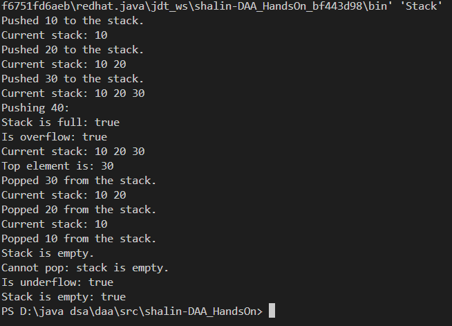

# HandsOn_8

# Problem 1

* Code for quicksort to implement the ith order statistic is given [`QuickSelect.java`](QuickSelect.java)

 
<b>Output:</b>

 
 

# Problem 2

*  Code for Stack Implementation is given [`Stack.java`](Stack.java)
 

<b>Output:</b>

*  Code for Queue Implementation is given [`Queue.java`](Queue.java)
 

<b>Output:</b>

*  Code for SinglyLinkedList Implementation is given [`SinglyLinkedList.java`](SinglyLinkedList.java)
 

<b>Output:</b>

