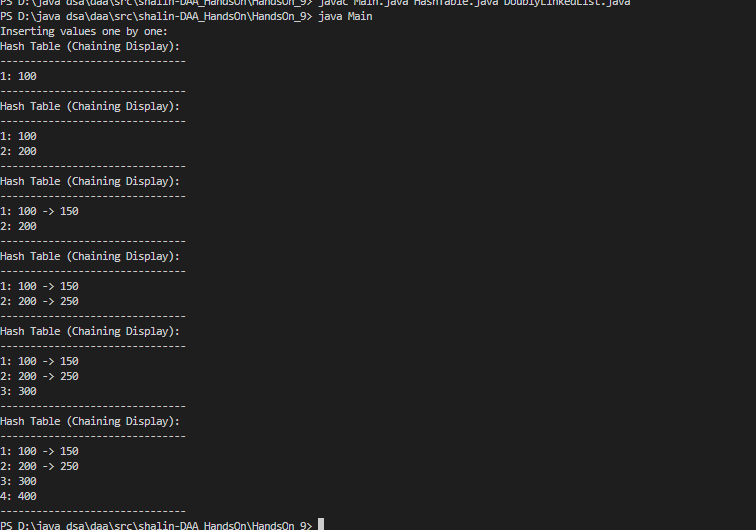

# HandsOn_9

# Problem 1

* Code for Hash Table is given [`Main.java`](Main.java) [`HashTable.java`](HashTable.java) [`DoublyLinkedList.java`](DoublyLinkedList.java)

* To run compile all file Main.java, HashTable.java, DoublyLinkedList.java then run Main.java

 
<b>Output:</b>

 
 

